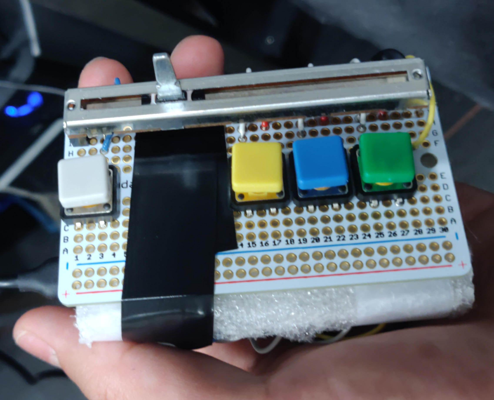

# DIY Media Controller

Only for Ubuntu right now. Tested on Ubuntu 20.04.



## Hardware
**Note:** This is a reference design. You can create your own board with different controllers and adapt the code accordingly.

- Arduino
- Breadboard PCB
- 10k slider potentiometer
- Several push buttons
- Misc: Jumper cables, resistors, electric tape, soldering equipment

## Setup and run

Make up a media controller unit on a breadboard. Load the firmware in `fw` folder onto your Arduno. Check the code for wiring. Then connect the Arduino via USB to your host computer.

On your computer, make sure you have Python3 installed. Then install `serial` package with:
```bash
pip install pyserial
```
Run the python script:
```bash
python media_control.py
```

**Tip:** Use a tmux session to run the script on the background.